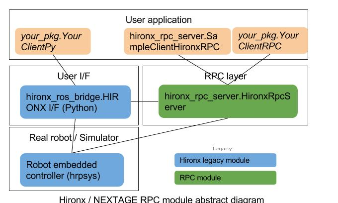

================================================================
Hironx RPC (Remote Procedure Call) ROS package
================================================================

.. contents:: Table of Contents
   :depth: 3

Introduction
============

RPC (Remote Procedure Call) feature for higher level of robot operations for the Hironx-variant robots   (i.e. Hironx, NEXTAGE Open).

Required environment
------------------------

Having the following software installed is assumed.

* Ubuntu 14.04
* ROS Indigo
* `hrpsys <http://wiki.ros.org/hrpsys>`_ 315.10.1 or higher
* `rtmros_common <http://wiki.ros.org/rtmros_common>`_ 1.3.2 or higher
* (Hironx users) `rtmros_hironx <http://wiki.ros.org/rtmros_hironx>`_ 1.1.21 or higher
* (NEXTAGE users) `rtmros_nextage <http://wiki.ros.org/rtmros_nextage>`_ 0.7.15 or higher

Install
========

Install binary (RECOMMENDED)
--------------------------------

(Not completely ready as of March 20, 2017)

The following command should install all necessary packages.

::

  sudo apt-get install ros-indigo-hironx-rpc

Install from source
--------------------------------

Although in the following example your `Catkin workspace <http://wiki.ros.org/catkin/Tutorials/create_a_workspace>`_ named is assumed to be named as `cws_rpc`, you can change it as you wish, or use your own existing one as needed::

  sudo apt-get install python-catkin-tools python-rosdep python-wstool
  mkdir -p ~/cws_rpc/src && cd ~/cws_rpc
  wstool init src
  wstool merge -t src https://raw.githubusercontent.com/tork-a/hironx_rpc/master/.rosinstall
  wstool update -t src
  rosdep install -r -y --from-paths src --ignore-src
  catkin build
  source devel/setup.bash

Usage
=====

You simply need to (0) run RTM-ROS bridge (1) run RPC server, and you're ready to (2) execute your commands.

0. ROS-RTM bridge
------------------

`hironx_rpc_server` is based on ROS Service, so `RTM-ROS bridge` needs to be running on your Ubuntu computer.
As documented in `the tutorial <http://wiki.ros.org/rtmros_nextage/Tutorials/Operating%20Hiro%2C%20NEXTAGE%20OPEN#Run_rtm_ros_bridge>`_ also, do the following.

Note that running `ROS-RTM bridge` isn't RPC specific; you need them to be running when you want to program in ROS for these robots.

0-a. Working with a real robot
++++++++++++++++++++++++++++++++

::

  roslaunch hironx_ros_bridge hironx_ros_bridge_real.launch nameserver:=%HOSTNAME%    (Hironx)

  roslaunch nextage_ros_bridge nextage_ros_bridge_real.launch nameserver:=%HOSTNAME%  (NEXTAGE OPEN. nextage is the most commonly used value)

0-b. Working with a simulated robot
++++++++++++++++++++++++++++++++++++++

Run hrpsys-simulator::

  rtmlaunch hironx_ros_bridge hironx_ros_bridge_simulation.launch    (Hironx)
  
  rtmlaunch nextage_ros_bridge nextage_ros_bridge_simulation.launch  (NEXTAGE Open)

1. Run RPC server
------------------

Run RPC server that starts ROS nodes for RPC::

  roslaunch hironx_rpc_server rpc.launch      (Real robot)

  roslaunch hironx_rpc_server rpc_sim.launch  (Simulation)

By default this assumes your robot's hostname is `hiro`. You can change by passing an argument as follows. If you're not sure what this is about, see `this tutorial again <http://wiki.ros.org/rtmros_nextage/Tutorials/Install%20NEXTAGE%20OPEN%20software%20on%20your%20machine#Working_with_a_real_robot>`_::
   
  roslaunch hironx_rpc_server rpc.launch CORBA_NAMESERVER_NAME:=nextage  (Many NEXTAGE users use `nextage` as the robot's hostname)

2. Execute your command
------------------------

RPC invocations defined in this package are normal ROS Service (+ some Actions). So call them by the ROS Service manner.

To see the list of all RPCs, see `hironx_rpc_server/sample_rpc.py <https://github.com/start-jsk/rtmros_hironx/blob/indigo-devel/hironx_rpc_server/src/hironx_rpc_server/sample_rpc.py>`_. All methods in that Python file that start with `sample_` are the example of how you can call RPCs defined.

You can use the sample methods on `ipython` terminal, which can be run as::

  ipython -i `rospack find hironx_rpc_server`/script/sample_rpc_script.py

Then call the methods through `sample_rpc` object. For example::

  In [1]: sample_rpc.sample_goInitial()

Tech support 
=============

Search existing issues, submit a ticket at `the repository <https://github.com/start-jsk/rtmros_hironx/issues>`_.

Software Design
=================

RPC layer is what's defined in this package `hironx_rpc`. 

Some existing ROS topics and services are utilized from `hrpsys_ros_bridge <http://wiki.ros.org/hrpsys_ros_bridge>`_ package, but still majority of underlining Topics/Services are created (and stored in `hironx_rpc_msgs <http://wiki.ros.org/hironx_rpc_msgs>`_).

Acknowledgement
================

The work initially taken to create this package was sponsored by `Keio University Yamaguchi Lab <http://www.yamaguti.comp.ae.keio.ac.jp/en/index.en.html>`_.

Indices and tables
==================

* :ref:`genindex`
* :ref:`modindex`
* :ref:`search`

EoF
